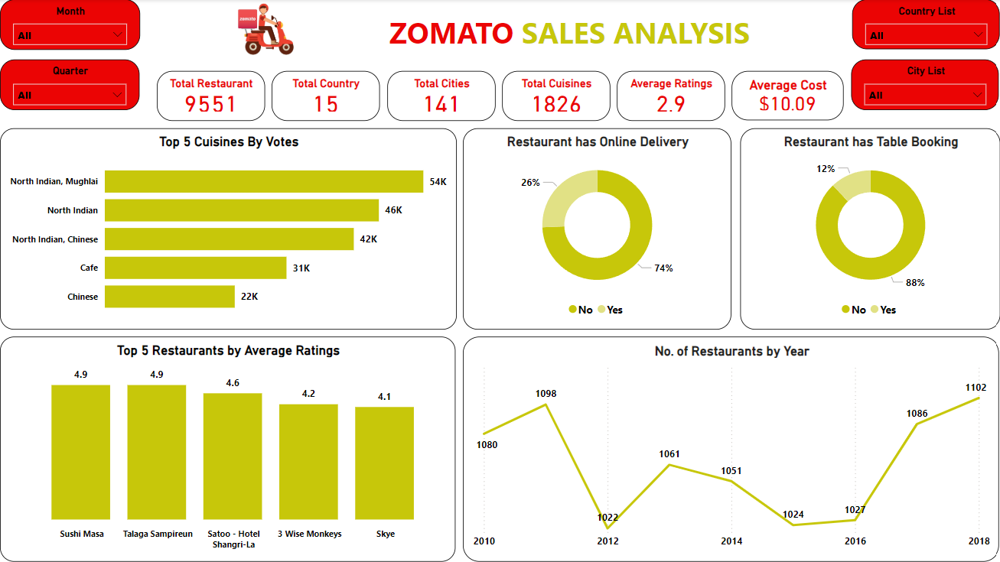

This project involves analyzing restaurant data using **Power BI** for visualization and **MySQL** for managing employee-related data. The focus was on deriving actionable insights through data modeling, querying, and interactive dashboard creation.  

---

## Key Tasks  

1. **Restaurant Data Analysis**  
   - Built a relational data model using restaurant datasets.  
   - Designed interactive Power BI dashboards to visualize metrics, including:  
     - Restaurant openings by year, quarter, and month.  
     - City-wise and country-wise restaurant distribution.  
     - Percentage of restaurants offering table bookings and online delivery.  
     - Restaurant segmentation based on cost and ratings.  

2. **Employee Data Analysis**  
   - Designed and optimized MySQL databases for employee-related datasets.  
   - Developed SQL queries to generate insights, such as:  
     - Salary analysis and comparisons across departments.  
     - Employee rankings based on performance metrics.  
     - Department-wise performance summaries.  

---

## Tools & Technologies  

- **Power BI**: For building dashboards and visualizing restaurant data.  
- **MySQL**: For querying and analyzing employee data.  

---

## Key Insights  

- Restaurant trends: openings by time period, distribution by location, and service types offered.  
- Employee insights: salary distribution, performance comparisons, and department-level summaries.  

---

## Dashboard created for analysis

### Using Power BI:

### SQL Programs:
- [Program_1](analysis_1.sql)
- [Program_2](analysis_2.sql)
